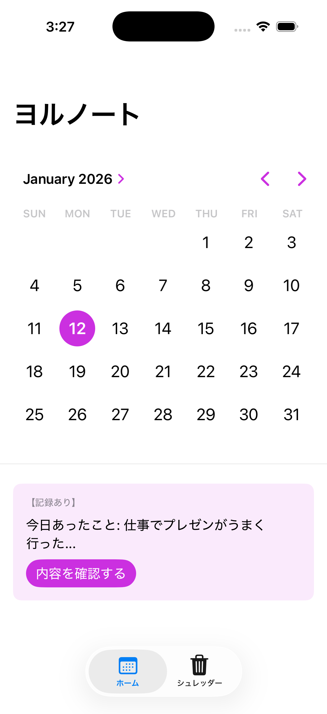
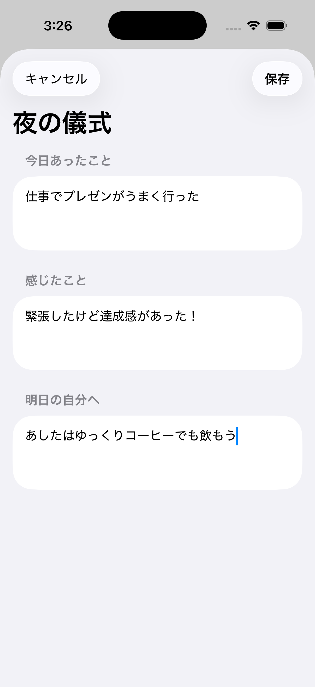
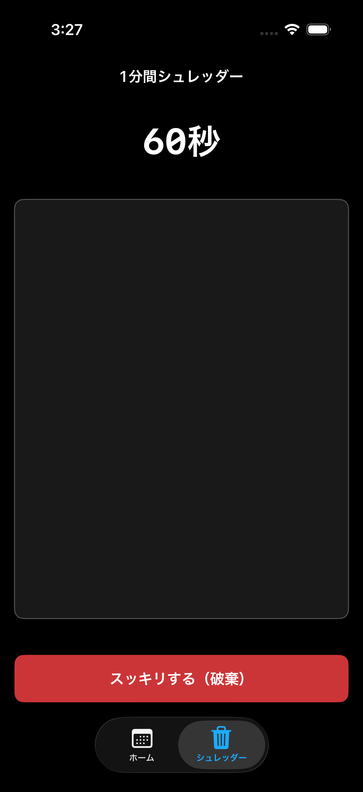

# 🌙 ヨルノート (Yoru Note)

**夜の3分間で、心をリセットして眠りにつくための場所。**

「ヨルノート」は、今日一日の出来事や感情を整理し、モヤモヤをすっきり手放してから眠りにつくためのセルフケアアプリです。

## ✨ コンセプト

一日の終わり、寝る前のわずかな時間を使って自分自身と向き合います。「書くこと」で心を整え、明日をより良い気持ちで迎えるためのデジタルな休息場所を提供します。

## 🛠 主要機能

### 1. 夜の三行儀式

「今日あったこと」「感じたこと」「明日の自分へ」の3つの項目を埋めるだけで、一日の振り返りが完了します。

* **カレンダー表示:** 記録した日はドットで表示。過去の自分からのメッセージをいつでも読み返せます。
* **シンプルな保存:** 1日1件、大切な言葉だけを積み重ねていきます。

### 2. 1分間書き殴りシュレッダー

今の心にある「モヤモヤ」や「不安」をひたすら吐き出すためのおまけ機能です。

* **あえて保存しない:** 1分間書き殴った内容は、ボタンひとつでバラバラに砕け散ります。
* **心を軽くする:** 記録に残したくない感情を、その場で見送ることで心を軽くします。

## 📷 スクリーンショット

  
  
  

## 🚀 技術スタック

* **UI Framework:** SwiftUI
* **Database:** SwiftData (iOS 17+)
* **Date Management:** Calendar API
* **Animations:** SwiftUI Animation & Transitions

## ⚖️ ライセンス

This project is licensed under the MIT License - see the [LICENSE](LICENSE) file for details.
